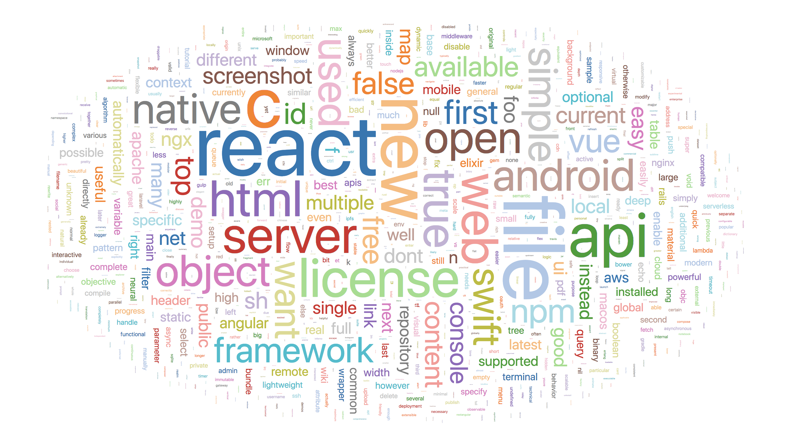
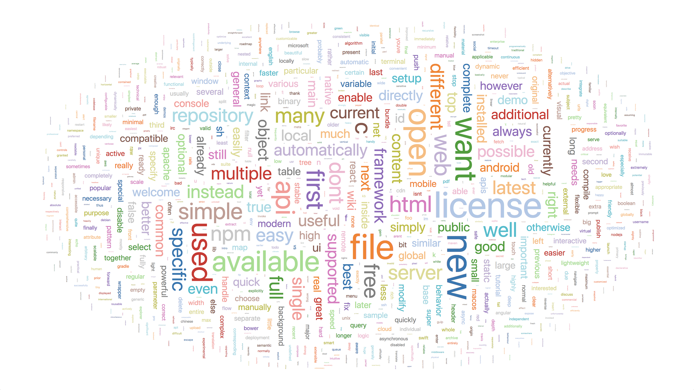

# Intro

Read about this project on Medium: [Open Source Words – Part 2](https://medium.com/@tbarrasso/open-source-words-part-2-ce1077305a32)

Open Source Words is a project that:

- Uses [Scrapy](https://scrapy.org/) to collect repository information from [GitHub Search](https://github.com/search) results
- Downloads README files from these repositories
- Converts README files (`md`, `rst`, and `html`) to plaintext
- Calculates unique and total word frequencies, filtering [stop words](https://en.wikipedia.org/wiki/Stop_words) and by parts of speech

Ironically, this project contains a README (this document you're reading), though it's unlikely to ever make the Top 2000 projects on GitHub by stars. It never had a change to scrape it's own README.

# Results

## Total frequencies

## Unique frequencies

These word clouds were generated using [d3-cloud](https://github.com/jasondavies/d3-cloud) using the code in [`wordcloud.js`](./wordcloud.js).

The top 10 words by **total frequency** were:

- React
- File
- C
- New
- API
- License
- Server
- Web
- HTML
- True

And by **unique frequency**:

- New
- License
- File
- Open
- Want
- Used
- Available
- API
- First
- Simple
